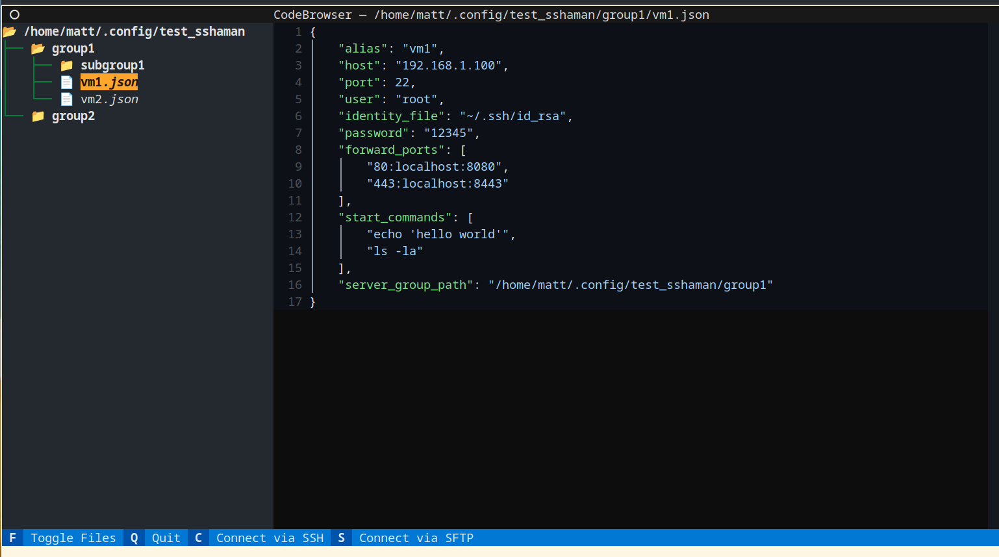

# SSHaMan - SSH Management

SSHaMan is a tool for managing SSH connections and configurations in a Linux shell. It provides an easy-to-use interface for managing multiple SSH connections, saving configurations, and quickly connecting to remote servers.

## Features

- Manage multiple SSH connections
- Save and load SSH configurations
- Quickly connect to remote servers

# Screenshots
## TUI


## CLI


## Installation

To install SSHaMan, you can clone the repository and install the dependencies:

```bash
git clone https://github.com/cornyhorse/sshaman.git
cd sshaman

# Create a Python virtual environment
python3 -m venv venv

# Activate the virtual environment
source venv/bin/activate

pip install -r requirements.txt
```
Sure, here's how you can set up an alias in bash, zsh, and fish shells:

**Bash and Zsh**

In bash and zsh, you can add an alias by editing the `~/.bashrc` or `~/.zshrc` file respectively. Here's an example of how to add an alias named `sshaman` that runs the `python main.py` command:

```bash
echo "alias smn='/path/to/venv/pyton /path/to/your/main.py'" >> ~/.bashrc
```

Replace `/path/to/your/main.py` with the actual path to your `main.py` file. After adding this line, you'll need to source your shell's configuration file for the changes to take effect:

```bash
source ~/.bashrc
```

For zsh, replace `~/.bashrc` with `~/.zshrc`.

**Fish**

In fish, you can add an alias by using the `alias` and `funcsave` commands. Here's an example of how to add an alias named `sshaman` that runs the `python main.py` command:

```fish
alias smn '/path/to/venv/python /path/to/your/main.py'
funcsave smn
```

Replace `/path/to/your/main.py` with the actual path to your `main.py` file. The `funcsave` command saves the function for future sessions.

After setting up the alias, you can run the `sshaman` command in your shell to run your script.

## CLI Usage

SSHaMan provides several command-line functions for managing SSH connections:

- ` `: No functions passed beings the TUI 
  ```bash
  smn 
  ```
- `add-server`: Adds a server to the SSHaMan configuration. <group-path> is a period delimited path.
  ```bash
  smn add-server <group-path> <server-name> <server-address>
  ```
- `make-group`: Creates a group in the SSHaMan configuration. <group-path> is a period delimited path.
  ```bash
  smn make-group <group-path>
  ```
- `initialize-sample`: Initializes a sample SSHaMan configuration in ~/.config/sshaman.
  ```bash
  smn initialize-sample
  ```
- `list-all`: Lists all groups and servers.
  ```bash
  smn list-all
```
